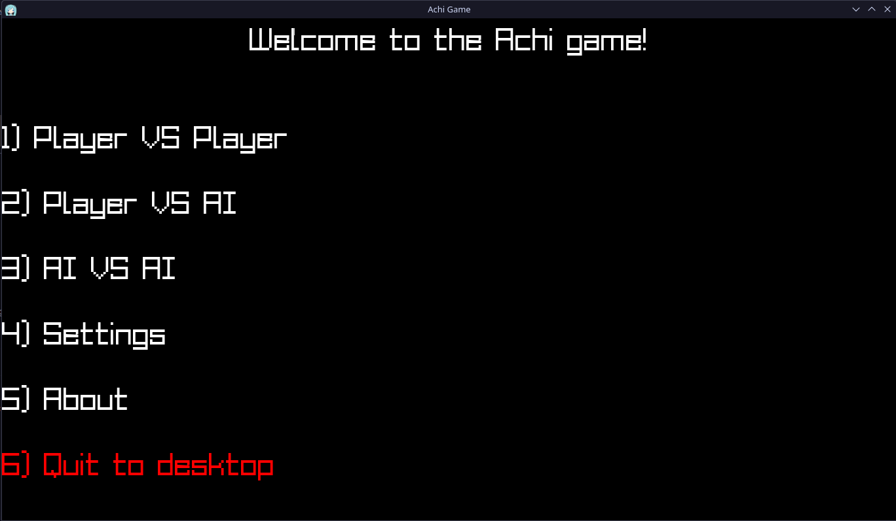
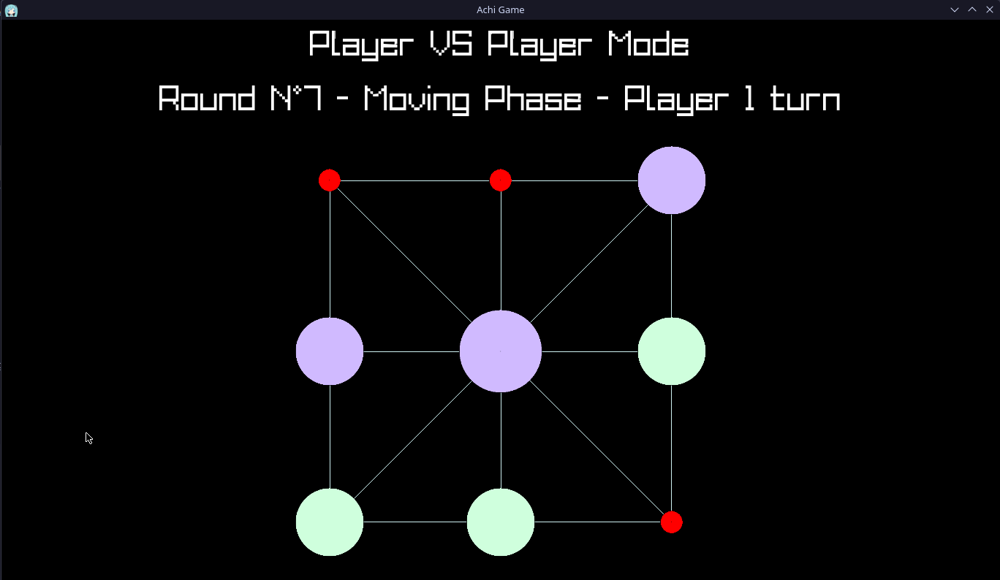
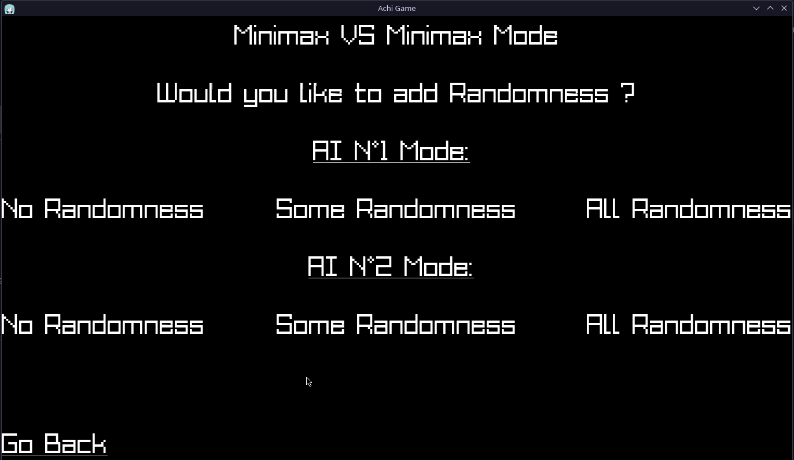

# Achi Game in C23 SDL3

## Introduction 
Achi is a Ghanian game that is similar to Tic-Tac-Toe, with the distinction of two phases and move sets rather than one, and the grid-like board (though it can be represented in the traditional Tic-Tac-Toe board). Players take turns placing one piece per round until both players have placed 3 pieces each, we call this *The Placement Phase*, we then enter the second phase *The Movement Phase* where players take turns moving pieces to one of their adjacent free spots. This is done until someone wins by forming a line (Horizontal, Vertical or Diagonal), or a draw if the game reaches the limited number of rounds.

## How to build 
Assuming you have SDL3 SDL3_image and SDL3_ttf libs and includes installed from your package manager (or manually) and you also have `cmake` installed :

```shell
git clone https://github.com/Paranoid-Pufferfish/Achi --recurse-submodules
cd Achi
mkdir build && cd build
cmake .. -DSTATIC_PROJECT:BOOL=ON # Set to OFF to make a dynamically linked binary
cmake --build . --parallel --clean-first --config Release
```
## Screenshots






## Authors

- [MOUHOUS Mathya (G3)](https://github.com/MathyazSnoozin)
- [AIT MEDDOUR Fouâd-Eddine (G1)](https://github.com/Paranoid-Pufferfish)

## Reviewers & Contributors

- [Mikka](https://github.com/cvyl)
- [Mohand Tahar Belkebir](https://github.com/mtbelkebir)

## License

This project is Licensed under the [BSD-3-Clause](https://spdx.org/licenses/BSD-3-Clause.html) license.