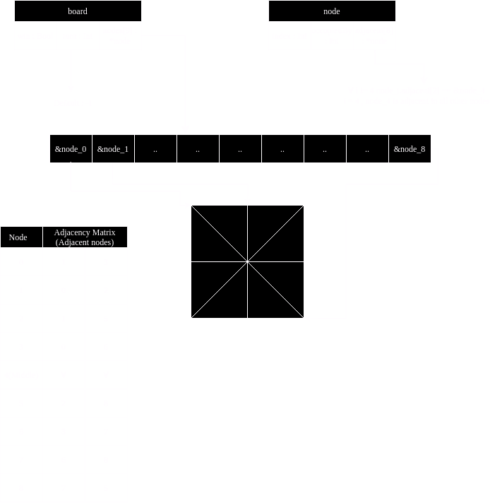

# Achi game writeup
## Technologies Used
This project uses *[meson 1.5.2](https://github.com/mesonbuild/meson)* as a build system, *[C23](https://en.wikipedia.org/wiki/C23_(C_standard_revision))*, and **MAYBE** *[raylib master branch](https://github.com/raysan5/raylib)*.

Developed on both *[Ubuntu 24.10](https://ubuntu.com/)* and *[Gentoo Linux](https://www.gentoo.org/)*
## Data Structures used
```c++
typedef struct node {
    int index;
    int occupiedBy;
    struct node *adjacent[8];
}node;
typedef struct board {
    bool win;
    int turn;
    node *nodes[9];
}board;
```


Note : We could've used a Linked List for adjacent nodes, and also only keep track of the first node in the `board` variable,
but the added complexity overweight's any actual benefit.