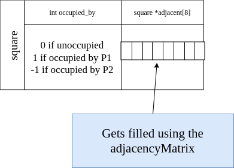
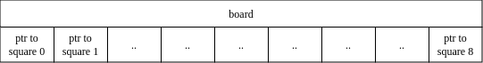
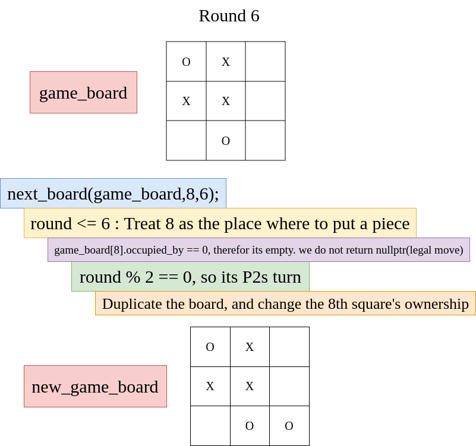
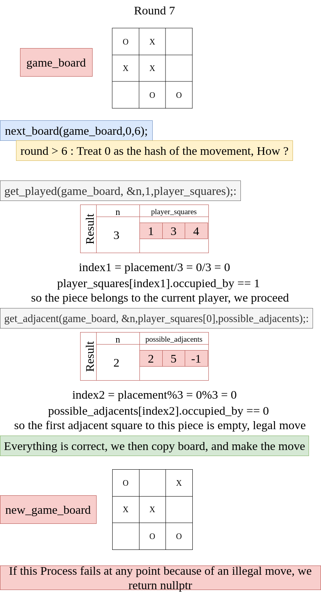
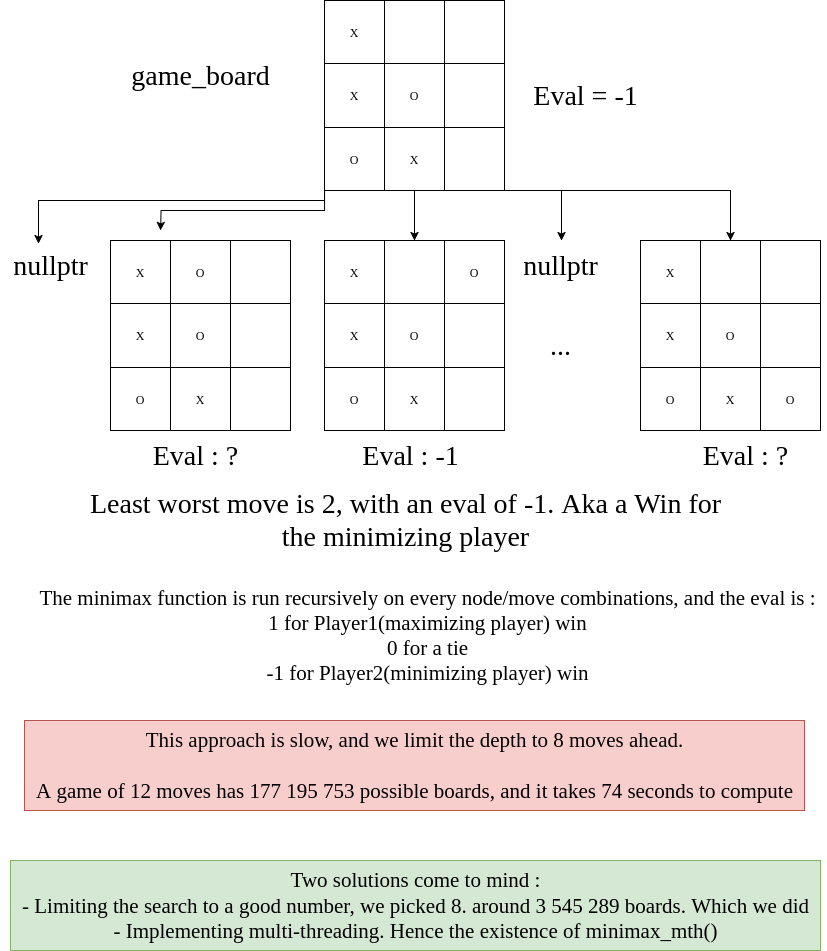

#+title: Writeup

* Introduction:

Achi is a Ghanian game that is similar to Tic-Tac-Toe, with the distinction of two phases and move sets rather than one, and the grid-like board (though it can be represented in the traditional Tic-Tac-Toe board). Players take turns placing one piece per round until both players have placed 3 pieces each, we call this *The Placement Phase*, we then enter the second phase *The Movement Phase* where players take turns moving pieces to one of their adjacent free spots. This is done until someone wins by forming a line (Horizontal, Vertical or Diagonal), or a draw if the game reaches the limited number of rounds.

* Technologies used:

For this project, we decided to go with [[https://en.cppreference.com/w/c/23][C23]] as a C standard, [[https://wiki.libsdl.org/][SDL3]] [[https://wiki.libsdl.org/SDL3_ttf/FrontPage][SDL3_TTF]] and [[https://wiki.libsdl.org/SDL3_image/][SDL3_image]] for rendering, and [[https://cmake.org/][cmake]] as a build system and [[https://www.dafont.com/grixel-acme-7-wide.font][Grixel Acme 9]] as a font. And most importantly [[https://notbyai.fyi/][NOT BY AI]].
The code lives on [[https://github.com/Paranoid-Pufferfish/Achi][This Github Repo]].

[[https://www.jetbrains.com/clion/][Jetbrains CLion]] and [[https://code.visualstudio.com/][Microsoft Visual Studio Code]] were used to make this project, and it was tested on [[https://www.gentoo.org/][Gentoo Linux]] and Windows 11.

* Authors:
- MOUHOUS Mathya *G3*
- AIT MEDDOUR Fouâd-Eddine *G1*

* The Writeup:
** Versions:
When building this project, two(2) targets will be present:
- *Achi-console*: A minimal, console only version of the project, the first version we created and also the most minimal one. The main difference between it and the SDL version is the AI configuration options, as it has only one rather than three.

- *Achi-SDL*: The full version, using SDL3 to render the game on a window, has more features and is overall more polished.

** Project Structure:
The main files in this project are as follow:

- *CMakeLists.txt*: configuration file for CMake which handles dependencies, building, and linking the different binaries, *mingw-w64-x86_64.cmake* was used for crosscompiling to Windows from Linux.
- *main.c*: The entry point for the Achi-SDL target.
- *main-con.c*: The entry point for the Achi-console target.

*** /src and /include:
C & Header files with the reused functions across the two targets, and to overall organise and tidy the structure a bit.
*** /media
Directory that contains the font used, alongside other assets required in runtime.

** Structs definitions:
A game board is made up of 9 squares which have an *occupied_by* attribute(Integer) and an array of 8 pointers to other squares, named *adjacent*. Making it a struct of size *72bytes* with *8bytes* for alignment. And a board is defined as a pointer to a square(or squares).

Making the Total Size of a single board: *728bytes*.

** Important Functions:
++Obviously we can NOT go over the entire code base, as its more than 2K lines of code. So we will instead highlight the key functions that are reused throughout the project:++ Fuck it, we are doing exactly this. AI could never

*** board create_board()
Self explanatory, it creates a board, and returns it, it is defined in *include/game_board.h* and starts by allocating memory space for an array of 9 squares, and sets the *game_board* variable to its pointer. And Loops over the squares, setting the ownership to 0 for none, and fills in the adjacent fields using the *adjacencyMatrix[9][2]* variable.
*** void get_played(board game_board, int *number, int player, int *squares)

Stores the indices of the squares played by *player* to *squares* and the number to *number*.

*** void get_adjacent(board game_board, int *number, int place, int *adjacents)

Stores the indices of the empty squares adjacent to the square *place* in the array *adjacents* and the number to *number*.

*** board next_board(board game_board, int placement, int round)

Returns a new board(or nullptr if the move is illegal) following the move *placement*. In the first 6 rounds it is treated as the index of the square to place the piece in, but after that, it is treated as follow:

- Placement / 3 is the index of the piece to move **in the array returned by get_played()**.
- Placement % 3 is the index of the square to move TO **in the array returned by get_adjacent()**.

*** pair minimax(board game_board, const bool maximizing, int n, int max_depth)

A simple implementation of the minimax Algorithm to get the best possible move in a round *n* up until the round *max_depth*. Returns a pair of a best move and its evaluation.

Minimax is a deterministic Algorithm that works on the structure of a Tree, and the concept of the "Least Bad Move" as a playing strategy.
*** pair minimax_mth(board game_board, const bool maximizing, int n, int max_depth, int thread_count);
Same as the one before, but with multithreading with the pthreads.h library, only works in UNIX for now.

** Game Modes:
*** Player VS Player:
Self Explanatory, the game is played between two human players until one of them wins, or the maximum round is reached.
*** Player VS AI:
The game is played between an AI using the minimax algorithm (with a depth of *round + dls_limit*, or 8 rounds ahead) the player who plays first is picked before starting the game.
*** AI VS AI:
A mode to visualise a game between two AIs, possible configuration for each AI is:
- No Randomness (Same as Player VS AI, aka using minimax), two Non Random AIs playing against eachother will result in an infinite loop.
- Some Randomness: Plays using the minimax algorithm, but there is a chance of making a random move, this chance is determined by the entropy variable.
- All Randomness: All moves are random and unpredictable*.

** Windows/Linux differences:
*** Randomness:
When building for Windows, *srand()* is used to handle randomness, alongside using time as the seed, which is cryptographically insecure. On GNU/Linux on the other hand, *arc4random* is used.
*** Multithreading:
When Building for windows, *minimax_mth* is NOT used as *pthreads.h* is not part of the C standard for Windows, and can't be used in mingw. On Linux however, its used with 2 threads as a sane default.
